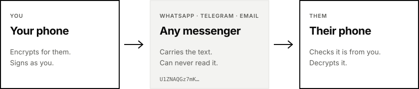

<div align="center">

<picture>
  <source media="(prefers-color-scheme: dark)" srcset="assets/readme/header-dark.svg">
  
</picture>

### Private messages over any messenger.

Svoboda encrypts on your phone with post-quantum cryptography.<br>
WhatsApp, Telegram or email carry the result. Only the person you wrote to can read it.

<br>

[](https://expo.dev/accounts/oblivionware/projects/svoboda/builds/befe28ce-e06f-46c7-8597-6ba245b68d8d)
&nbsp;
[](#ios)

[](https://csrc.nist.gov/pubs/fips/203/final)
[](https://csrc.nist.gov/pubs/fips/204/final)
[](https://expo.dev)
[](LICENSE)

</div>

<br>

> [!WARNING]
> **Not yet reviewed.** The message format has not had an independent security review. Use Svoboda to try it out, not to protect anything that matters.

<br>

## How it works

<picture>
  <source media="(prefers-color-scheme: dark)" srcset="assets/readme/how-it-works-dark.svg">
  
</picture>

|  |  |
|---|---|
| **Create your identity** | Your phone generates a key pair. The private key never leaves it. |
| **Add someone** | Meet in person and scan each other's code. Compare fingerprints out loud. |
| **Send** | Pick who it's to, write, tap *Copy encrypted*, paste it into any chat. |
| **Receive** | Copy what they sent, pick who it's from, tap *Paste and decrypt*. |

*Svoboda* means freedom in most Slavic languages.

<br>

## Under the hood

| | |
|---|---|
| **Encryption** | ML-KEM-768 (FIPS 203) agrees a fresh key for every message |
| **Signatures** | ML-DSA-65 (FIPS 204) proves who wrote it |
| **Message cipher** | XChaCha20-Poly1305, keyed through HKDF-SHA256 |
| **Your keys** | Kept in the phone's keychain, never synced to another device |
| **Contacts** | Public keys only, stored on your phone. No servers, no accounts |

<details>
<summary><b>Message format</b></summary>

<br>

Each message is base64 text you can paste anywhere:

```
header ("SVM" · version · suite) │ ML-KEM-768 ciphertext │ nonce │ XChaCha20-Poly1305 ciphertext │ ML-DSA-65 signature
```

Both people's fingerprints are authenticated with the message, so it only opens for the person it was written to, and only when checked against the person who wrote it. The suite byte leaves room for new algorithms, such as FN-DSA once FIPS 206 is final, without breaking existing contacts.

A short message comes out at about 6,000 characters. Messengers like WhatsApp, Telegram and Signal take that easily; SMS doesn't.

Source: [`src/lib/message.ts`](src/lib/message.ts), [`src/lib/contact-card.ts`](src/lib/contact-card.ts).

</details>

<br>

## Install

### Android

1. On your phone, open the [Android download](https://expo.dev/accounts/oblivionware/projects/svoboda/builds/befe28ce-e06f-46c7-8597-6ba245b68d8d) and download the APK.
2. Open it. If Android asks, allow your browser or file manager to install unknown apps.
3. Tap **Install**.

Updates install the same way and keep your identity and contacts.

### iOS

Svoboda isn't on the App Store. You can sideload it with your own Apple ID, at no cost:

1. Install [AltStore](https://altstore.io), [SideStore](https://sidestore.io) or [Sideloadly](https://sideloadly.io) by following its guide.
2. Download `Svoboda-<version>-unsigned.ipa` from the [latest release](https://github.com/TzvetomirTz/svoboda/releases/latest).
3. Open it with that app and sign in with your Apple ID when asked.

> [!NOTE]
> With a free Apple ID, the install expires after 7 days. AltStore and SideStore can refresh it automatically; with Sideloadly, sideload it again. Your identity and contacts stay on the phone as long as you don't delete the app. A free Apple ID can have three sideloaded apps at a time.

<br>

## For developers

<details>
<summary><b>Run it locally</b></summary>

<br>

```bash
nvm use            # Node 24 LTS
npm install
npx expo start     # then scan the QR code with Expo Go
```

Run `npx tsc --noEmit` and `npx expo lint` before committing. After changing an icon master in `assets/`, run `npm run icons`.

</details>

<details>
<summary><b>Make a release</b></summary>

<br>

1. Set the new version in `app.json` (`expo.version`).
2. Commit, then tag and push:
   ```bash
   git tag v1.0.0
   git push origin v1.0.0
   ```
   The **iOS release** workflow builds the unsigned `.ipa` and attaches it to a draft GitHub Release for the tag. The tag must match the version in `app.json`.
3. Build the Android APK:
   ```bash
   npx eas-cli@latest build --platform android --profile release
   ```
4. Download the APK from EAS, rename it `Svoboda-<version>.apk` and add it to the draft release.
5. Publish the release.

EAS keeps the Android signing key. Every update must be signed with the same key, so keep a backup (`npx eas-cli@latest credentials`). If it's lost, people have to uninstall Svoboda, and lose their identity and contacts, to update.

</details>

<br>

---

<div align="center">

<sub>Powered by <b>OblivionWare</b> · <a href="LICENSE">MIT License</a></sub>

</div>
